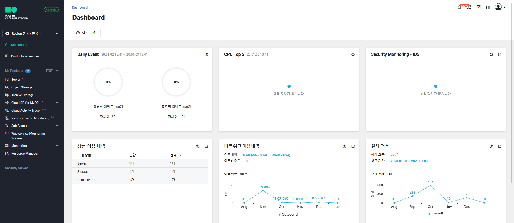
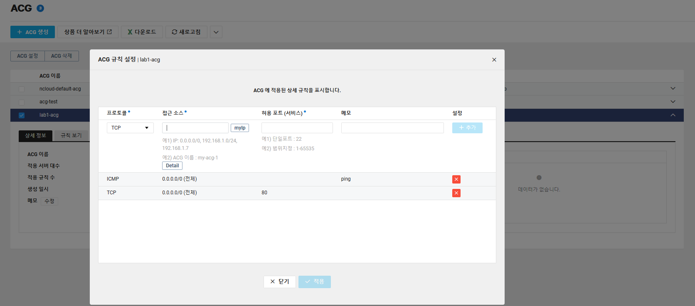
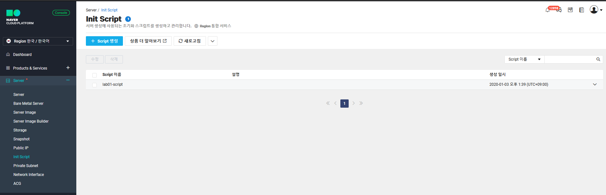
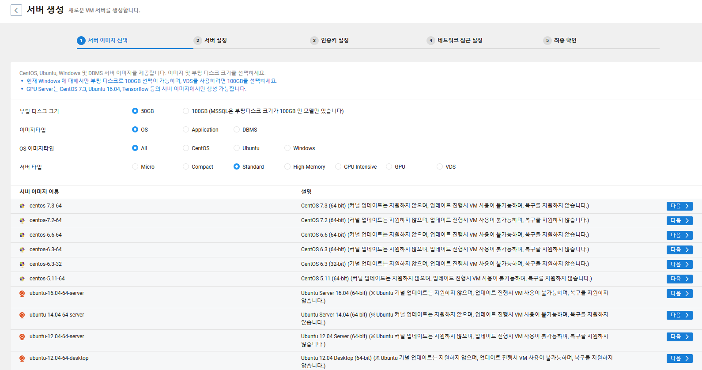
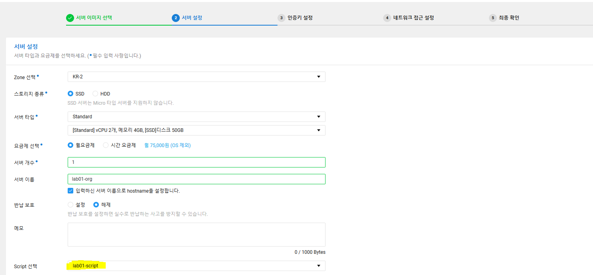
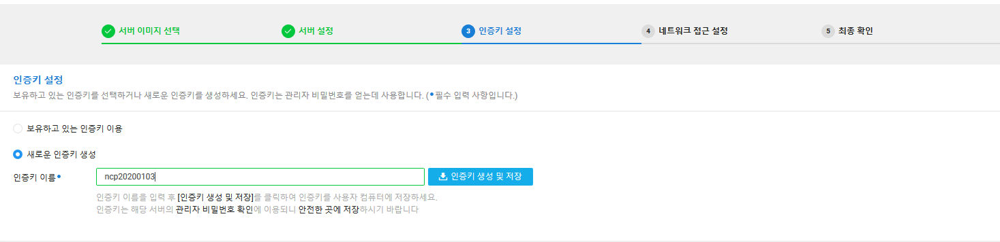

## 네이버 클라우드 서버 설정

0. 초기화면

01 - ACG(Access Control Group) 생성
  - AWS로 하면 Security Group으로 볼 수 있다.

02. Init script 설정
  - 서버를 처음 생성하고 Httpd, php 등 초기 설정 파일 설치 및 설정을 함

03. 서버 

05.

이미지한 서버를 생성시 root나 administrator의 패스워드는 변경됨. 단 그 하위 유저의 계정 및 패스워드는 유지
