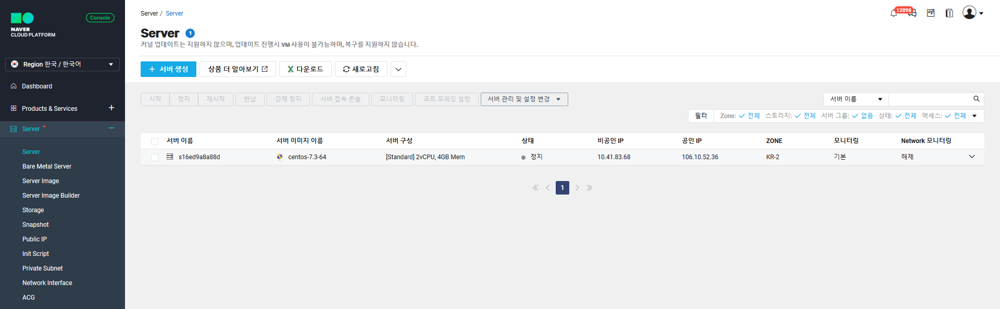

## 네이버 클라우드 서버 설정

0. 초기화면

01 - ACG(Access Control Group) 생성
  - AWS로 하면 Security Group으로 볼 수 있다.

02. Init script 설정
  - 서버를 처음 생성하고 Httpd, php 등 초기 설정 파일 설치 및 설정을 함

~~~bash
#!/bin/bash

yum -y install httpd php mysql php-mysql
systemctl enable httpd
cd /var/www/html
wget http://211.249.50.207/lab/lab.tgz
tar xvfz lab.tgz
cat phpadd >> /etc/httpd/conf/httpd.conf
systemctl start httpd

echo 'ncp!@#123' | passwd --stdin root
~~~

03. 서버 

04. 공인 IP 할당

05. 서버 이미지 생성

  - 이미지한 서버를 생성시 root나 administrator의 패스워드는 변경됨. 단 그 하위 유저의 계정 및 패스워드는 유지

06. 스토리지 생성

